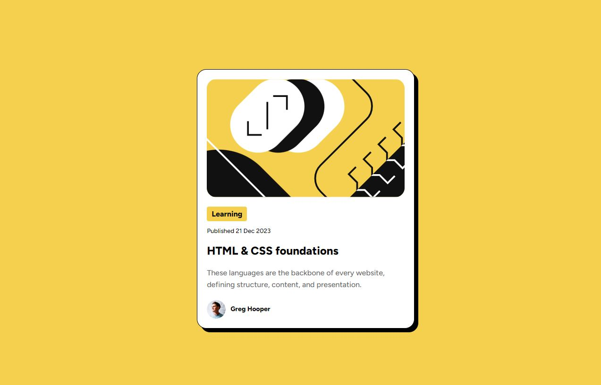

# Frontend Mentor - Blog preview card solution

This is a solution to the [Blog preview card challenge on Frontend Mentor](https://www.frontendmentor.io/challenges/blog-preview-card-ckPaj01IcS). Frontend Mentor challenges help you improve your coding skills by building realistic projects. 

## Table of contents

- [Overview](#overview)
  - [The challenge](#the-challenge)
  - [Screenshot](#screenshot)
  - [Links](#links)
  - [Built with](#built-with)
  - [What I learned](#what-i-learned)
  - [Continued development](#continued-development)
- [Author](#author)

## Overview

### The challenge

Users should be able to:

- See hover and focus states for all interactive elements on the page

### Screenshot



### Links

- Solution URL: [Frontend Mentor](https://www.frontendmentor.io/solutions/blog-preview-card-solution-nbou1f1yo8)
- Live Site URL: [Handled by Github](https://clipzorama.github.io/Blog-Preview-Card-Solution-F.M/)

## My process

### Built with

- Semantic HTML5 markup
- CSS custom properties
- Flexbox


### What I learned

During this project, I deepened my understanding of the box-shadow property, which allowed me to create a stylish, elevated card with a distinct shadow effect. This solution was a bit easier than previous ones, but I still found room for improvement.

I also continued practicing media queries, although there wasn’t much to adjust for smaller screens in this particular project. It helped me feel more confident in responsive design.

```html
<section class="all-content">
        <div class="card">
            
            <div class="label">Learning</div>
            <h5>Published 21 Dec 2023</h5>
            <h2>HTML & CSS foundations</h2>
            <p class="details">These languages are the backbone of every website, defining structure, content, and
                presentation.</p>
            <div class="signature">
                
                <p class="name">Greg Hooper</p>
            </div>
        </div>
    </section>

```

```css

* {
    margin: 0;
    padding: 0;
}
body {
    background-color: var(--Yellow);
}
.all-content {
    height: 100vh;
    display: flex;
    justify-content: center;
    align-items: center;
}
.card {
    background-color: var(--White);
    display: flex;
    flex-direction: column;
    border-radius: 20px;
    width: 22%;
    border: 1px solid black;
    padding: 20px;
    box-shadow: 8px 8px 0 0 black;
    font-family: "Figtree";
}

```

### Continued development

Moving forward, I want to focus more on:

- Mobile First Workflow: Starting my designs with mobile layouts first and then progressively enhancing them for larger screens. This workflow will allow me to create more responsive websites that adapt well to all device sizes.

- Exploring more advanced CSS techniques like grid for layout or animations to make my components more interactive.

## Author

- Frontend Mentor - [@Clipzorama](https://www.frontendmentor.io/profile/Clipzorama)


